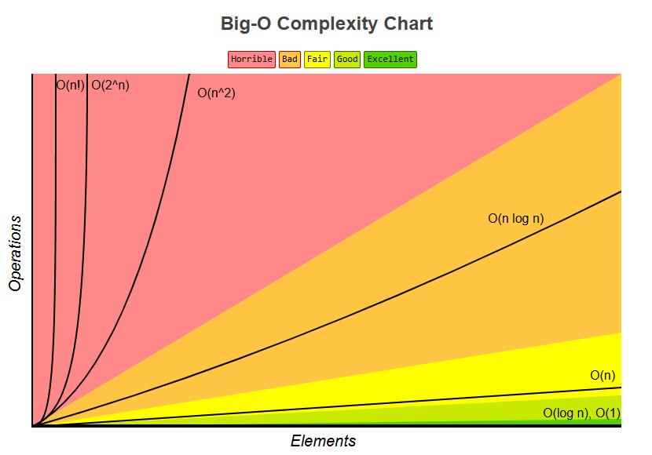

# Algorithms and Data Structures

An **algorithm** is a finite sequence of well-defined steps designed to solve a specific problem or compute a result. Algorithms can be represented as text, pseudocode, flowcharts or program code. They must exhibit **finiteness**, **determinism**, **effectiveness** and have **input/output data**.

**Key Properties of Algorithms:**

- **Finiteness** — must complete in a finite number of steps.
- **Determinism** — each step must be precisely defined.
- **Effectiveness** — must produce a correct result.
- **Input/Output Data** — takes one or more inputs and produces one or more outputs.

A **data structure** is a way of organizing, storing and managing data in computer memory to enable efficient access and modification. Different data structures are optimized for different operations, such as insertion, deletion, search and sorting.

**Key Properties of Data Structures:**

- **Organization** — defines how data is stored (linear, hierarchical, etc.).
- **Efficiency** — allows basic operations to be performed in optimal time.
- **Flexibility** — ability to dynamically change the size or structure of data.

## Asymptotic growth notations

| Symbols         | Borders        | Growth |
| --------------- | -------------- | :----: |
| Θ (Big Theta)   | Top and Bottom |   =n   |
| O (Big O)       | Top            |  <=n   |
| o (Small O)     | Top            |   <n   |
| Ω (Big Omega)   | Bottom         |  >=n   |
| ω (Small Omega) | Bottom         |   >n   |

## Complexity

| Name         | Notation |
| ------------ | :------: |
| Constant     |   O(1)   |
| Logarithmic  | O(logn)  |
| Linear       |   O(n)   |
| Linearithmic | O(nlogn) |
| Quadratic    |  O(n^2)  |
| Cubic        |  O(n^3)  |
| Exponential  |  O(2^n)  |
| Factorial    |  O(n!)   |

## Data Structures

- [Array](structures/array.md)
- [Stack](structures/stack.md)
- [Queue](structures/queue.md)
- [Singly Linked List](structures/signlyLinkedList.md)
- [Doubly Linked List](structures/doublyLinkedList.md)
- [Hash Table](structures/hashTable.md)
- [Binary Search Tree (BST)](structures/binarySearchTree.md)
- [Binary Heap](structures/binaryHeap.md)

| Name               |        Access         |        Search         |        Insert         |        Delete         |
| ------------------ | :-------------------: | :-------------------: | :-------------------: | :-------------------: |
| Array              |         O(1)          |         O(n)          |      Ω(1) / O(n)      |      Ω(1) / O(n)      |
| Stack              |         O(n)          |         O(n)          |         O(1)          |         O(1)          |
| Queue              |         O(n)          |         O(n)          |         O(1)          |         O(1)          |
| Singly Linked List |      Ω(1) / O(n)      |      Ω(1) / O(n)      |         O(1)          |         O(1)          |
| Doubly Linked List |      Ω(1) / O(n)      |      Ω(1) / O(n)      |         O(1)          |         O(1)          |
| Hash Table         |      Θ(1) / O(n)      |      Θ(1) / O(n)      |      Θ(1) / O(n)      |      Θ(1) / O(n)      |
| Binary Search Tree | Ω(1) / Θ(logn) / O(n) | Ω(1) / Θ(logn) / O(n) | Ω(1) / Θ(logn) / O(n) | Ω(1) / Θ(logn) / O(n) |

| Name        | Create | Search Max | Extract Max | Increase Key | Insert  | Delete  | Merge  |
| ----------- | :----: | :--------: | :---------: | :----------: | :-----: | :-----: | :----: |
| Binary Heap |  O(n)  |    O(1)    |   O(logn)   |   O(logn)    | O(logn) | O(logn) | O(m+n) |

## Algorithms

- **Search:**
  - [Linear Search](algorithms/linearSearch.md)
  - [Binary Search](algorithms/binarySearch.md)
  - [Deep-First Search](algorithms/deepFirstSearch.md)
  - [Breadth-First Search](algorithms/breadthFirstSearch.md)
- **Sort:**
  - [Bubble Sort](algorithms/bubbleSort.md)
  - [Insertion Sort](algorithms/insertionSort.md)
  - [Selection Sort](algorithms/selectionSort.md)
  - [Merge Sort](algorithms/mergeSort.md)
  - [Quick Sort](algorithms/quickSort.md)
  - [Heap Sort](algorithms/heapSort.md)

## Problems

1. [Two Sum](problems/twoSum.md)
   - **Description:** given an array of numbers and a target number, find a pair of indices such that the sum of the values equals the target.
   - **What It Tests:** knowledge of hash tables and time optimization (achieving O(n) solution).
2. [Reverse a Linked List](problems/reverseLinkedList.md)
   - **Description:** given a singly linked list, reverse it so that the last element becomes the first.
   - **What It Tests:** ability to work with linked data structures and understanding pointers.
